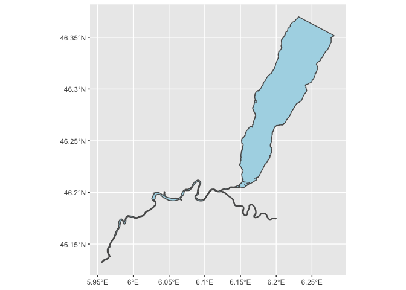
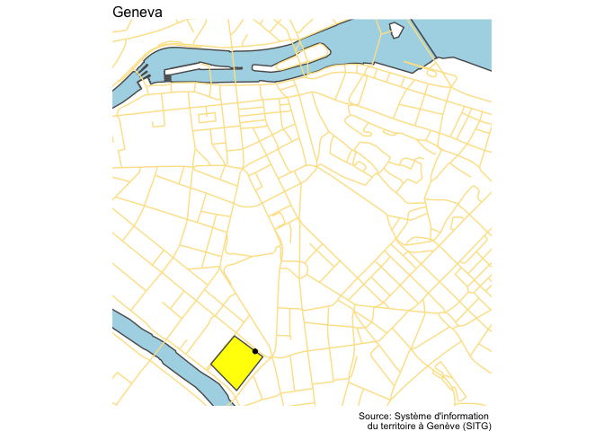
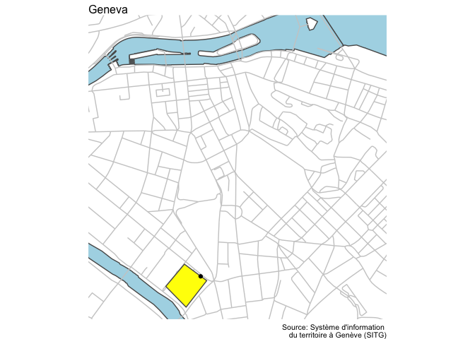
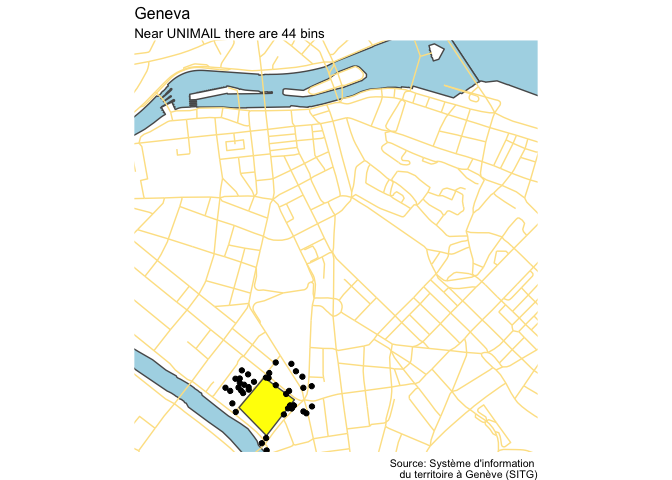
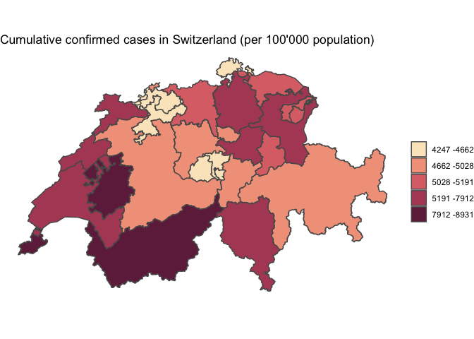
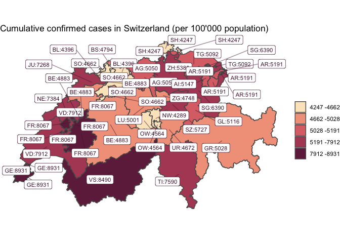

# Cartography in R: and introduction

The vector data model represents the world using points, lines and
polygons.

## Starting with `{sf}`

`{sf}` stands for simple features, which refers to a formal standard
(ISO 19125-1:2004) that describes how objects in the real world can be
represented in computers, with emphasis on the spatial geometry of these
objects. It also describes how such objects can be stored in and
retrieved from databases, and which geometrical operations should be
defined for them. As we will see later, the `{sf}` library works very
well with the `{tidyverse}`

``` r
# install.packages(c("tidyverse", "sf", "ggrepel",
#                    "tmap", "tmaptools"))


library(tidyverse)
```

``` r
library(sf) # the library for spatial data visualisation
```

    ## Linking to GEOS 3.8.1, GDAL 3.1.1, PROJ 6.3.1

`{sf}` functions are all consistent: they all start with `st_*`, which
stands for spatio temporal.

Let’s start by creating a point in space.

``` r
# creating our first spatial object, a point in space
unimail_point <- st_point(x = c(46.1952452857602, 6.14051554056255))

unimail_point 
```

    ## POINT (46.19525 6.140516)

``` r
class(unimail_point)
```

    ## [1] "XY"    "POINT" "sfg"

``` r
# creating  a more familiar tibble, with latitude and longitude coordinates
# each location is a vertex of unimail

unimail_df <- tribble(
  ~location, ~lat, ~lon,
  "a", 46.19377633846322, 6.1399410679254744,
  "b", 46.19491952134567, 6.141224481424885,
  "c", 46.194671442623196, 6.138677026705302,
  "d", 46.195630227161544, 6.139834520389675
  )

unimail_df 
```

    ## # A tibble: 4 x 3
    ##   location   lat   lon
    ##   <chr>    <dbl> <dbl>
    ## 1 a         46.2  6.14
    ## 2 b         46.2  6.14
    ## 3 c         46.2  6.14
    ## 4 d         46.2  6.14

``` r
# we transform the unimail_df into a sf data.frame

unimail <- unimail_df %>% 
  st_as_sf(coords=c("lon", "lat"), #selecting the variables with the coordinates
           crs = "EPSG:4326") # selecting the projection


unimail
```

    ## Simple feature collection with 4 features and 1 field
    ## geometry type:  POINT
    ## dimension:      XY
    ## bbox:           xmin: 6.138677 ymin: 46.19378 xmax: 6.141224 ymax: 46.19563
    ## geographic CRS: WGS 84
    ## # A tibble: 4 x 2
    ##   location            geometry
    ## * <chr>            <POINT [°]>
    ## 1 a        (6.139941 46.19378)
    ## 2 b        (6.141224 46.19492)
    ## 3 c        (6.138677 46.19467)
    ## 4 d        (6.139835 46.19563)

``` r
plot(unimail)
```

<!-- -->

``` r
# from a series of point, we actually want to create a polygon

unimail_polygon <- unimail %>%
  mutate(location_name = "unimail") %>% # creating a grouping variable
  group_by(location_name) %>%
  dplyr::summarise() %>%
  st_cast("POLYGON") %>% # will cast the points to a polygon
  st_convex_hull() # makes sure the polygon is not convex
```

    ## `summarise()` ungrouping output (override with `.groups` argument)

``` r
unimail_polygon
```

    ## Simple feature collection with 1 feature and 1 field
    ## geometry type:  POLYGON
    ## dimension:      XY
    ## bbox:           xmin: 6.138677 ymin: 46.19378 xmax: 6.141224 ymax: 46.19563
    ## geographic CRS: WGS 84
    ## # A tibble: 1 x 2
    ##   location_name                                                         geometry
    ## * <chr>                                                            <POLYGON [°]>
    ## 1 unimail       ((6.139941 46.19378, 6.138677 46.19467, 6.139835 46.19563, 6.14…

``` r
plot(unimail_polygon)
```

<!-- -->

``` r
class(unimail_polygon)
```

    ## [1] "sf"         "tbl_df"     "tbl"        "data.frame"

``` r
unimail_polygon
```

    ## Simple feature collection with 1 feature and 1 field
    ## geometry type:  POLYGON
    ## dimension:      XY
    ## bbox:           xmin: 6.138677 ymin: 46.19378 xmax: 6.141224 ymax: 46.19563
    ## geographic CRS: WGS 84
    ## # A tibble: 1 x 2
    ##   location_name                                                         geometry
    ## * <chr>                                                            <POLYGON [°]>
    ## 1 unimail       ((6.139941 46.19378, 6.138677 46.19467, 6.139835 46.19563, 6.14…

## From sfg (simple feature geometry) to sfc (simple feature column) to sf data frame

Why use this data type and `{sf}`

  - Fast reading and writing of data
  - **visualisation**: enhanced plotting performance and new `geom_sf()`
    for `{ggplot}.`
  - **transferability**`sf data.frames` can be treated as data frames in
    most operations
  - **uniformity**: `{sf}` functions can be combined using %\>% operator
    and works
  - works well with the tidyverse collection of R packages
  - **consistency**sf function names are relatively consistent and
    intuitive (all begin with st\_)

## Properties of `sf data.frame`s

  - geometries are sticky

<!-- end list -->

``` r
unimail_polygon %>% 
  select(-geometry)
```

    ## Simple feature collection with 1 feature and 1 field
    ## geometry type:  POLYGON
    ## dimension:      XY
    ## bbox:           xmin: 6.138677 ymin: 46.19378 xmax: 6.141224 ymax: 46.19563
    ## geographic CRS: WGS 84
    ## # A tibble: 1 x 2
    ##   location_name                                                         geometry
    ##   <chr>                                                            <POLYGON [°]>
    ## 1 unimail       ((6.139941 46.19378, 6.138677 46.19467, 6.139835 46.19563, 6.14…

``` r
unimail_polygon %>% 
  select(location_name)
```

    ## Simple feature collection with 1 feature and 1 field
    ## geometry type:  POLYGON
    ## dimension:      XY
    ## bbox:           xmin: 6.138677 ymin: 46.19378 xmax: 6.141224 ymax: 46.19563
    ## geographic CRS: WGS 84
    ## # A tibble: 1 x 2
    ##   location_name                                                         geometry
    ##   <chr>                                                            <POLYGON [°]>
    ## 1 unimail       ((6.139941 46.19378, 6.138677 46.19467, 6.139835 46.19563, 6.14…

``` r
unimail_polygon[,"location_name"]
```

    ## Simple feature collection with 1 feature and 1 field
    ## geometry type:  POLYGON
    ## dimension:      XY
    ## bbox:           xmin: 6.138677 ymin: 46.19378 xmax: 6.141224 ymax: 46.19563
    ## geographic CRS: WGS 84
    ## # A tibble: 1 x 2
    ##   location_name                                                         geometry
    ##   <chr>                                                            <POLYGON [°]>
    ## 1 unimail       ((6.139941 46.19378, 6.138677 46.19467, 6.139835 46.19563, 6.14…

Only way to get rid of those is using `st_drop_geometry()`.

``` r
st_drop_geometry(unimail_polygon)
```

    ## # A tibble: 1 x 1
    ##   location_name
    ## * <chr>        
    ## 1 unimail

## Waste bins in Geneva

Data downloaded from the Système d’information du territoire à Genève
(SITG).

`st_read()` is used to read in geometries, that are stored in
shapefiles.

``` r
# locations of geneva bins
# loading a shapefile

bins <- st_read("data/SHP_VDG_CORBEILLES_DECHETS/VDG_CORBEILLES_DECHETS.shp") 
```

    ## Reading layer `VDG_CORBEILLES_DECHETS' from data source `/Users/gruggeri/Documents/projects/r_lunch_feb2021/data/SHP_VDG_CORBEILLES_DECHETS/VDG_CORBEILLES_DECHETS.shp' using driver `ESRI Shapefile'
    ## Simple feature collection with 3632 features and 4 fields
    ## geometry type:  POINT
    ## dimension:      XY
    ## bbox:           xmin: 2497537 ymin: 1115229 xmax: 2502660 ymax: 1120863
    ## projected CRS:  CH1903+ / LV95

The data is although projectes using swiss mercator: “CH1903+ / LV95”,
we want to use although the same projection as the `unimail_polygon`,
which is in the projection used in google maps.

``` r
bins <- bins %>% 
  st_transform(crs = "EPSG:4326") #apply transformation
```

``` r
# shapes for the roads
roads <- st_read("data/SHP_GMO_GRAPHE_ROUTIER/GMO_GRAPHE_ROUTIER.shp") %>% 
  st_transform(crs = "EPSG:4326")
```

    ## Reading layer `GMO_GRAPHE_ROUTIER' from data source `/Users/gruggeri/Documents/projects/r_lunch_feb2021/data/SHP_GMO_GRAPHE_ROUTIER/GMO_GRAPHE_ROUTIER.shp' using driver `ESRI Shapefile'
    ## Simple feature collection with 11920 features and 37 fields
    ## geometry type:  LINESTRING
    ## dimension:      XY
    ## bbox:           xmin: 2485760 ymin: 1109951 xmax: 2512878 ymax: 1135575
    ## projected CRS:  CH1903+ / LV95

``` r
# shapes for the water
water <- st_read("data/SHP_GEO_LAC/GEO_LAC.shp") %>% 
  st_transform(crs = "EPSG:4326")
```

    ## Reading layer `GEO_LAC' from data source `/Users/gruggeri/Documents/projects/r_lunch_feb2021/data/SHP_GEO_LAC/GEO_LAC.shp' using driver `ESRI Shapefile'
    ## Simple feature collection with 3 features and 3 fields
    ## geometry type:  POLYGON
    ## dimension:      XY
    ## bbox:           xmin: 2485388 ymin: 1110037 xmax: 2510891 ymax: 1136120
    ## projected CRS:  CH1903+ / LV95

## Plotting geometries with `{ggplot2}`

`geom_sf()` is our new ggplot2 friend

``` r
ggplot()+
  geom_sf(
    data =water,
    fill = "lightblue"
    )
```

<!-- -->

``` r
ggplot()+
  geom_sf(
    data =water,
    fill = "lightblue"
    )+
  geom_sf(
    data = roads,
    color = "#fde293")
```

<!-- -->

``` r
ggplot()+
  geom_sf(
    data =water,
    fill = "lightblue"
    )+
  geom_sf(
    data = roads,
    color = "#fde293") +
  theme_void()+ # adding theme void
  coord_sf(ylim = c(46.193854, 46.205765),
           xlim = c(6.134706, 6.151571)) # zooming in
```

<!-- -->

``` r
# plot the data 
ggplot()+
  geom_sf(
    data =water,
    fill = "lightblue"
    )+
  geom_sf(
    data = roads,
    color = "#fde293") +
  geom_sf(data =unimail_polygon,  # adding polys
          fill = "yellow") +
  geom_sf(data = bins, # and the bins
          alpha = 0.1) +
  coord_sf(ylim = c(46.193854, 46.205765),
           xlim = c(6.134706, 6.151571)) +
  labs(title = "Geneva",
       caption = "Source: Système d'information \n du territoire à Genève (SITG)")+
  theme_void(base_size = 10)
```

<!-- -->

## Manipulating geometries

``` r
st_intersection(unimail_polygon, bins)
```

    ## although coordinates are longitude/latitude, st_intersection assumes that they are planar

    ## Warning: attribute variables are assumed to be spatially constant throughout all
    ## geometries

    ## Simple feature collection with 1 feature and 5 fields
    ## geometry type:  POINT
    ## dimension:      XY
    ## bbox:           xmin: 6.140845 ymin: 46.19511 xmax: 6.140845 ymax: 46.19511
    ## geographic CRS: WGS 84
    ## # A tibble: 1 x 6
    ##   location_name SERVICE MODELE SUPPORT ANGLE            geometry
    ## * <chr>         <chr>   <chr>  <chr>   <dbl>         <POINT [°]>
    ## 1 unimail       VVP     110l   <NA>        0 (6.140845 46.19511)

``` r
ggplot()+
  geom_sf(
    data =water,
    fill = "lightblue"
    )+
  geom_sf(
    data = roads,
    color = "#fde293") +
  geom_sf(data =unimail_polygon,  # adding polys
          fill = "yellow") +
  geom_sf(data = st_intersection(unimail_polygon, bins)) + #only unimail bin
  coord_sf(ylim = c(46.193854, 46.205765),
           xlim = c(6.134706, 6.151571)) +
  labs(title = "Geneva",
       caption = "Source: Système d'information \n du territoire à Genève (SITG)")+
  theme_void(base_size = 10)
```

    ## although coordinates are longitude/latitude, st_intersection assumes that they are planar

    ## Warning: attribute variables are assumed to be spatially constant throughout all
    ## geometries

<!-- -->

Let’s look a bit further away from the polygon

``` r
buffered_polys <-  st_buffer(unimail_polygon, 
                             dist = 0.001) # distance is in degrees..
```

    ## Warning in st_buffer.sfc(st_geometry(x), dist, nQuadSegs, endCapStyle =
    ## endCapStyle, : st_buffer does not correctly buffer longitude/latitude data

    ## dist is assumed to be in decimal degrees (arc_degrees).

``` r
ggplot()+
  geom_sf(
    data = buffered_polys,
    fill = "lightblue"
    )+
  geom_sf(
    data = unimail_polygon,
    color = "#fde293")
```

<!-- -->

``` r
st_intersection(buffered_polys, bins)
```

    ## although coordinates are longitude/latitude, st_intersection assumes that they are planar

    ## Warning: attribute variables are assumed to be spatially constant throughout all
    ## geometries

    ## Simple feature collection with 44 features and 5 fields
    ## geometry type:  POINT
    ## dimension:      XY
    ## bbox:           xmin: 6.138054 ymin: 46.19299 xmax: 6.142033 ymax: 46.19611
    ## geographic CRS: WGS 84
    ## # A tibble: 44 x 6
    ##    location_name SERVICE MODELE SUPPORT ANGLE            geometry
    ##  * <chr>         <chr>   <chr>  <chr>   <dbl>         <POINT [°]>
    ##  1 unimail       VVP     110l   <NA>        0  (6.14074 46.19445)
    ##  2 unimail       VVP     110l   <NA>        0 (6.141104 46.19465)
    ##  3 unimail       VVP     110l   <NA>        0 (6.141199 46.19474)
    ##  4 unimail       VVP     35l    <NA>        0 (6.141777 46.19449)
    ##  5 unimail       VVP     200l   <NA>        0 (6.139093 46.19573)
    ##  6 unimail       VVP     200l   <NA>        0  (6.138054 46.1953)
    ##  7 unimail       VVP     200l   <NA>        0 (6.139118 46.19532)
    ##  8 unimail       VVP     200l   <NA>        0  (6.138712 46.1956)
    ##  9 unimail       VVP     200l   <NA>        0 (6.138654 46.19531)
    ## 10 unimail       VVP     200l   <NA>        0 (6.138808 46.19586)
    ## # … with 34 more rows

``` r
ggplot()+
  geom_sf(
    data =water,
    fill = "lightblue"
    )+
  geom_sf(
    data = roads,
    color = "#fde293") +
  geom_sf(data =unimail_polygon, 
          fill = "yellow") +
  geom_sf(data = st_intersection(buffered_polys, bins))+ # bins close to unimail 
  coord_sf(ylim = c(46.193854, 46.205765),
           xlim = c(6.134706, 6.151571)) +
  labs(title = "Geneva",
       subtitle= glue::glue("Near UNIMAIL there are {nrow(st_intersection(buffered_polys, bins))} bins "),
       caption = "Source: Système d'information \n du territoire à Genève (SITG)")+
  theme_void(base_size = 10)
```

    ## although coordinates are longitude/latitude, st_intersection assumes that they are planar

    ## Warning: attribute variables are assumed to be spatially constant throughout all
    ## geometries

    ## although coordinates are longitude/latitude, st_intersection assumes that they are planar

    ## Warning: attribute variables are assumed to be spatially constant throughout all
    ## geometries

<!-- -->

## Overview presentation

## Making thematic maps (choropleth maps) of COVID-19 data

``` r
#importing COVID data
swiss_covid_latest <- read_csv("data/latest_swiss_data.csv")
```

    ## 
    ## ── Column specification ──────────────────────────────────────────────────────────────
    ## cols(
    ##   date = col_date(format = ""),
    ##   abbreviation_canton_and_fl = col_character(),
    ##   ncumul_tested_fwd = col_double(),
    ##   ncumul_conf_fwd = col_double(),
    ##   ncumul_hosp_fwd = col_double(),
    ##   ncumul_deceased_fwd = col_double(),
    ##   population = col_double(),
    ##   incidence = col_double()
    ## )

``` r
glimpse(swiss_covid_latest)
```

    ## Rows: 26
    ## Columns: 8
    ## $ date                       <date> 2021-02-01, 2021-02-01, 2021-02-01, 2021-…
    ## $ abbreviation_canton_and_fl <chr> "AG", "AI", "AR", "BE", "BL", "BS", "FR", …
    ## $ ncumul_tested_fwd          <dbl> 0, 0, 0, 0, 0, 235, 30, 187408, 14038, 0, …
    ## $ ncumul_conf_fwd            <dbl> 34251, 831, 2867, 50535, 12666, 9337, 2571…
    ## $ ncumul_hosp_fwd            <dbl> 89, 1, 18, 118, 18, 57, 38, 120, 11, 30, 1…
    ## $ ncumul_deceased_fwd        <dbl> 588, 15, 50, 923, 203, 179, 451, 681, 63, …
    ## $ population                 <dbl> 678207, 16145, 55234, 1034977, 288132, 194…
    ## $ incidence                  <dbl> 5050.228, 5147.104, 5190.643, 4882.717, 43…

### Importing the shapefiles

``` r
canton_shape <- st_read("data/SHAPEFILE_LV03_LN02/swissBOUNDARIES3D_1_3_TLM_KANTONSGEBIET.shp")
```

    ## Reading layer `swissBOUNDARIES3D_1_3_TLM_KANTONSGEBIET' from data source `/Users/gruggeri/Documents/projects/r_lunch_feb2021/data/SHAPEFILE_LV03_LN02/swissBOUNDARIES3D_1_3_TLM_KANTONSGEBIET.shp' using driver `ESRI Shapefile'
    ## Simple feature collection with 51 features and 20 fields
    ## geometry type:  POLYGON
    ## dimension:      XYZ
    ## bbox:           xmin: 485411 ymin: 75269.68 xmax: 833856.7 ymax: 295934
    ## z_range:        zmin: 193.51 zmax: 4613.729
    ## projected CRS:  CH1903 / LV03

``` r
glimpse(canton_shape)
```

    ## Rows: 51
    ## Columns: 21
    ## $ UUID       <chr> "{0B2364ED-49E0-4D53-A33C-C684DD530B57}", "{DDD56CEF-0E61-…
    ## $ DATUM_AEND <date> 2018-11-22, 2019-11-06, 2018-11-22, 2019-11-06, 2018-11-2…
    ## $ DATUM_ERST <date> 2012-10-26, 2012-10-26, 2012-10-26, 2012-10-26, 2012-10-2…
    ## $ ERSTELL_J  <dbl> 2012, 2012, 2012, 2012, 2012, 2012, 2012, 2012, 2012, 2012…
    ## $ ERSTELL_M  <chr> "10", "10", "10", "10", "10", "10", "10", "10", "10", "10"…
    ## $ REVISION_J <dbl> 2020, 2020, 2020, 2020, 2020, 2020, 2020, 2020, 2020, 2020…
    ## $ REVISION_M <chr> "10", "10", "10", "10", "10", "10", "10", "10", "10", "10"…
    ## $ GRUND_AEND <chr> "Verbessert", "Verbessert", "Verbessert", "Verbessert", "V…
    ## $ HERKUNFT   <chr> "AV", "swisstopo", "AV", "swisstopo", "AV", "swisstopo", "…
    ## $ HERKUNFT_J <dbl> 2019, 2019, 2019, 2019, 2019, 2018, 2019, 2015, 2019, 2017…
    ## $ HERKUNFT_M <chr> "1", "6", "1", "6", "1", "1", "1", "12", "6", "1", "1", "1…
    ## $ OBJEKTART  <chr> "Kanton", "Kanton", "Kanton", "Kanton", "Kanton", "Kanton"…
    ## $ REVISION_Q <chr> "2019_Aufbau", "2019_Aufbau", "2019_Aufbau", "2019_Aufbau"…
    ## $ ICC        <chr> "CH", "CH", "CH", "CH", "CH", "CH", "CH", "CH", "CH", "CH"…
    ## $ KANTONSNUM <dbl> 18, 2, 23, 22, 21, 17, 1, 10, 3, 19, 4, 20, 5, 26, 24, 11,…
    ## $ SEE_FLAECH <dbl> NA, 11897, 1060, 39097, 7147, 7720, 6811, 7818, 6438, 870,…
    ## $ KANTONSFLA <dbl> 710530, 595951, 522463, 321202, 281216, 202820, 172894, 16…
    ## $ KT_TEIL    <chr> "0", "1", "0", "1", "0", "1", "0", "1", "0", "1", "0", "1"…
    ## $ NAME       <chr> "Graubünden", "Bern", "Valais", "Vaud", "Ticino", "St. Gal…
    ## $ EINWOHNERZ <dbl> 198379, 1034977, 343955, 799145, 353343, 507697, 1520968, …
    ## $ geometry   <POLYGON [m]> POLYGON Z ((709776.1 185646..., POLYGON Z ((646448…

``` r
codes <- read_csv("data/canton_codes.csv")
```

    ## 
    ## ── Column specification ──────────────────────────────────────────────────────────────
    ## cols(
    ##   code = col_character(),
    ##   code_num = col_double()
    ## )

``` r
codes
```

    ## # A tibble: 26 x 2
    ##    code  code_num
    ##    <chr>    <dbl>
    ##  1 ZH           1
    ##  2 BE           2
    ##  3 LU           3
    ##  4 UR           4
    ##  5 SZ           5
    ##  6 OW           6
    ##  7 NW           7
    ##  8 GL           8
    ##  9 ZG           9
    ## 10 FR          10
    ## # … with 16 more rows

``` r
canton_shape <- canton_shape %>% 
  left_join(codes, c("KANTONSNUM" = "code_num")) %>% 
  left_join(swiss_covid_latest, c("code"= "abbreviation_canton_and_fl"))

glimpse(canton_shape)
```

    ## Rows: 51
    ## Columns: 29
    ## $ UUID                <chr> "{0B2364ED-49E0-4D53-A33C-C684DD530B57}", "{DDD56…
    ## $ DATUM_AEND          <date> 2018-11-22, 2019-11-06, 2018-11-22, 2019-11-06, …
    ## $ DATUM_ERST          <date> 2012-10-26, 2012-10-26, 2012-10-26, 2012-10-26, …
    ## $ ERSTELL_J           <dbl> 2012, 2012, 2012, 2012, 2012, 2012, 2012, 2012, 2…
    ## $ ERSTELL_M           <chr> "10", "10", "10", "10", "10", "10", "10", "10", "…
    ## $ REVISION_J          <dbl> 2020, 2020, 2020, 2020, 2020, 2020, 2020, 2020, 2…
    ## $ REVISION_M          <chr> "10", "10", "10", "10", "10", "10", "10", "10", "…
    ## $ GRUND_AEND          <chr> "Verbessert", "Verbessert", "Verbessert", "Verbes…
    ## $ HERKUNFT            <chr> "AV", "swisstopo", "AV", "swisstopo", "AV", "swis…
    ## $ HERKUNFT_J          <dbl> 2019, 2019, 2019, 2019, 2019, 2018, 2019, 2015, 2…
    ## $ HERKUNFT_M          <chr> "1", "6", "1", "6", "1", "1", "1", "12", "6", "1"…
    ## $ OBJEKTART           <chr> "Kanton", "Kanton", "Kanton", "Kanton", "Kanton",…
    ## $ REVISION_Q          <chr> "2019_Aufbau", "2019_Aufbau", "2019_Aufbau", "201…
    ## $ ICC                 <chr> "CH", "CH", "CH", "CH", "CH", "CH", "CH", "CH", "…
    ## $ KANTONSNUM          <dbl> 18, 2, 23, 22, 21, 17, 1, 10, 3, 19, 4, 20, 5, 26…
    ## $ SEE_FLAECH          <dbl> NA, 11897, 1060, 39097, 7147, 7720, 6811, 7818, 6…
    ## $ KANTONSFLA          <dbl> 710530, 595951, 522463, 321202, 281216, 202820, 1…
    ## $ KT_TEIL             <chr> "0", "1", "0", "1", "0", "1", "0", "1", "0", "1",…
    ## $ NAME                <chr> "Graubünden", "Bern", "Valais", "Vaud", "Ticino",…
    ## $ EINWOHNERZ          <dbl> 198379, 1034977, 343955, 799145, 353343, 507697, …
    ## $ code                <chr> "GR", "BE", "VS", "VD", "TI", "SG", "ZH", "FR", "…
    ## $ date                <date> 2021-02-01, 2021-02-01, 2021-02-01, 2021-02-01, …
    ## $ ncumul_tested_fwd   <dbl> 0, 0, 0, 0, 0, 0, 0, 30, 0, 0, 85, 276, 10, 0, 0,…
    ## $ ncumul_conf_fwd     <dbl> 9975, 50535, 29201, 63225, 26818, 32441, 81954, 2…
    ## $ ncumul_hosp_fwd     <dbl> 30, 118, 120, 214, 156, 75, 222, 38, 71, 89, 3, 3…
    ## $ ncumul_deceased_fwd <dbl> 166, 923, 688, 868, 936, 642, 1171, 451, 283, 588…
    ## $ population          <dbl> 198379, 1034977, 343955, 799145, 353343, 507697, …
    ## $ incidence           <dbl> 5028.254, 4882.717, 8489.773, 7911.581, 7589.792,…
    ## $ geometry            <POLYGON [m]> POLYGON Z ((709776.1 185646..., POLYGON Z…

``` r
#removing non useful columns

canton_shape <- canton_shape %>% 
  select(code, incidence)

glimpse(canton_shape)
```

    ## Rows: 51
    ## Columns: 3
    ## $ code      <chr> "GR", "BE", "VS", "VD", "TI", "SG", "ZH", "FR", "LU", "AG",…
    ## $ incidence <dbl> 5028.254, 4882.717, 8489.773, 7911.581, 7589.792, 6389.835,…
    ## $ geometry  <POLYGON [m]> POLYGON Z ((709776.1 185646..., POLYGON Z ((646448.…

### The `ggplot2` way

``` r
ggplot(data= canton_shape, 
       aes(fill = incidence))+
  geom_sf() +
  theme_void()
```

<!-- -->

I will now divide the continuous variable into categories. I will use
quantiles, as usually this way allows for colors, and therefore
categories, to be evenly distributed in our map.

``` r
quantile_vec <- quantile(canton_shape$incidence, 
                         na.rm = TRUE, 
                         probs = seq(0, 1, 0.2))

quantile_vec
```

    ##       0%      20%      40%      60%      80%     100% 
    ## 4246.808 4661.523 5028.254 5190.643 7911.581 8930.688

``` r
# I create a label to be used then in the plot

labels <- tibble(
  lab1 = quantile_vec,
  lab2 = c(quantile_vec[2:length(quantile_vec)], NA)) %>%
  slice(1:n() - 1) %>% 
  mutate_all(round, digits = 0) %>% 
  mutate(labs = paste(lab1, lab2, sep = " -"))

labels
```

    ## # A tibble: 5 x 3
    ##    lab1  lab2 labs      
    ##   <dbl> <dbl> <chr>     
    ## 1  4247  4662 4247 -4662
    ## 2  4662  5028 4662 -5028
    ## 3  5028  5191 5028 -5191
    ## 4  5191  7912 5191 -7912
    ## 5  7912  8931 7912 -8931

``` r
canton_shape <- canton_shape %>%
  mutate(incidence_cut = cut(incidence, # cutting the incidence
    breaks = quantile_vec,
    labels = labels %>% pull(labs),
    include.lowest = TRUE, # includes the lowest 'breaks' value
    ordered_result = TRUE, # orders the factors/bins
  ))

glimpse(canton_shape)
```

    ## Rows: 51
    ## Columns: 4
    ## $ code          <chr> "GR", "BE", "VS", "VD", "TI", "SG", "ZH", "FR", "LU", "…
    ## $ incidence     <dbl> 5028.254, 4882.717, 8489.773, 7911.581, 7589.792, 6389.…
    ## $ geometry      <POLYGON [m]> POLYGON Z ((709776.1 185646..., POLYGON Z ((646…
    ## $ incidence_cut <ord> 4662 -5028, 4662 -5028, 7912 -8931, 5191 -7912, 5191 -7…

### Plotting the data, the ggplot way

``` r
ggplot(data = canton_shape) +
  geom_sf(aes(fill = incidence_cut)) +
  rcartocolor::scale_fill_carto_d(type = "quantitative", 
                                  palette = "BurgYl")+
  theme_void() +
  labs(fill = "",
       title = paste0("Cumulative confirmed ", 
                      "cases in Switzerland (per 100'000 population)"),
       caption = str_glue("source: OFSP | updated {unique(canton_shape$date)}"))
```

<!-- -->

``` r
## Add labels to show the incidence by canton

ggplot(data = canton_shape) +
  geom_sf(aes(fill = incidence_cut)) +
  rcartocolor::scale_fill_carto_d(type = "quantitative", 
                                  palette = "BurgYl")+
  ggrepel::geom_label_repel(
    data = canton_shape,
    aes(label = paste0(code,":",round(incidence, digits = 0)), 
        geometry = geometry),
    stat = "sf_coordinates",
    min.segment.length = 0.2,
    colour = "#541f3f",
    size = 3,
    segment.alpha = 0.5
  ) +
  theme_void() +
  labs(fill = "",
       title = paste0("Cumulative confirmed ", 
                      "cases in Switzerland (per 100'000 population)"),
       caption = str_glue("source: OFSP | updated {unique(canton_shape$date)}"))
```

<!-- -->

### The `tmap` way

``` r
# install.packages(tmap)
# install.packages(tmaptools)
library(tmap) # library for thematic maps


tm_shape(canton_shape) + 
  tm_polygons(col = "incidence", 
              style = "quantile", 
              palette = "-viridis")
```

<!-- -->

``` r
osmbb <-  tmaptools::bb(canton_shape,
                        ext=1.1 )# to enlarge a bit the bounding box

osmtiles <- tmaptools::read_osm(osmbb, type="esri-topo")

tm_shape(osmtiles) + 
  tm_rgb() +
  tm_shape(canton_shape) + 
  tm_polygons(col = "incidence", 
              style = "quantile", 
              palette = "-viridis") +
  tm_layout(frame = FALSE)
```

<!-- -->

To make your map interactive, use `tmap_mode("view")` before plotting it

``` r
# tmap_mode("view") # make interactive
```

## Dive deeper

  - [Geocomputation with R](https://geocompr.robinlovelace.net)
  - [Spatial Data Science](https://keen-swartz-3146c4.netlify.app)
  - [An R spatial
    tutorial](https://github.com/statnmap/user2020_rspatial_tutorial/blob/master/slides_user2020_rspatial.pdf)
  - [examples from 30 day map
    challenge](https://github.com/Nowosad/rspatial-map-challenge-2020)
  - on Twitter check \#rspatial
